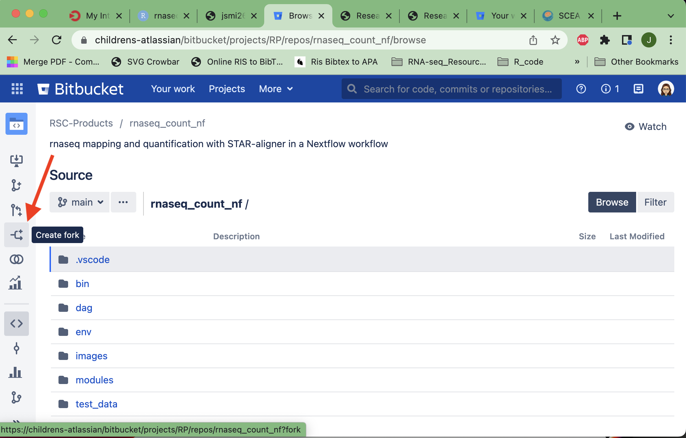
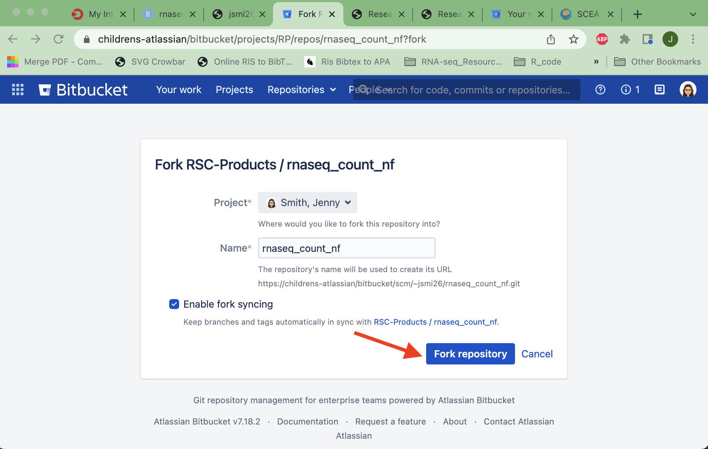
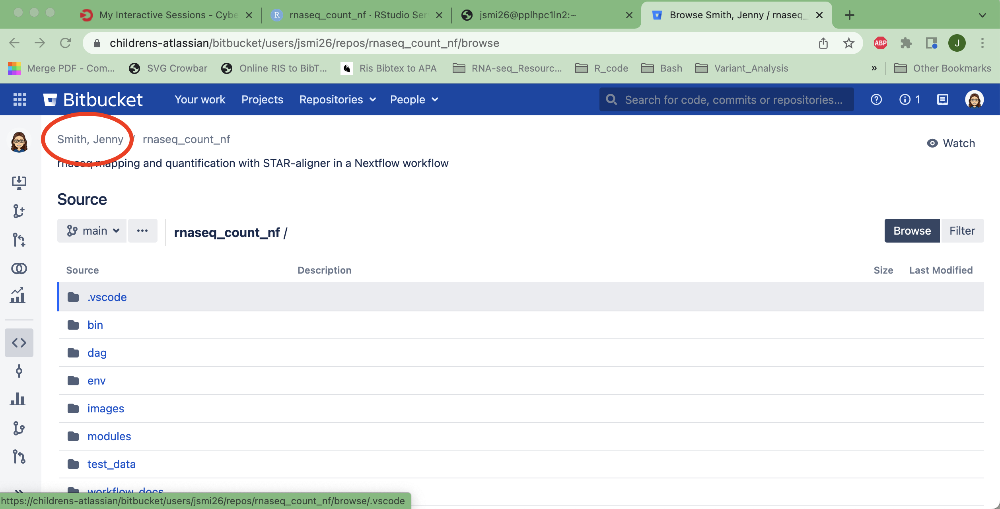
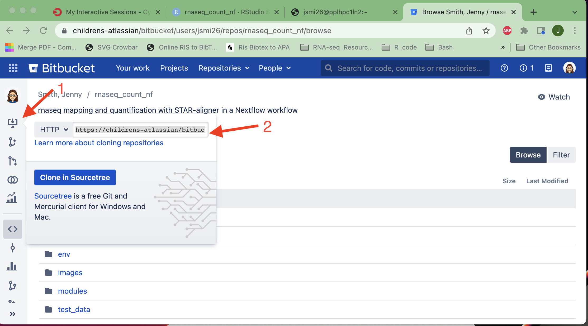

# RNA-seq Alignment, QC, and Quantification Nextflow Pipeline 

This pipeline uses publically available modules from [nf-core](https://nf-co.re/) with some locally created modules. The primary functionality is to run a workflow on 10s - 1000s of samples in parallel on the Seattle Children's Sasquatch HPC using the SLURM scheduler and containerized scientific software.

First, follow the steps on this page to make a personal copy of this repository. Then, the **step-by-step instructions to run the workflow: [`workflow_docs/workflow_run.md`](workflow_docs/workflow_run.md)** can be used. 

# About the Workflow

This workflow is designed to output gene expression counts from STAR aligner using [`--quantmode`](https://physiology.med.cornell.edu/faculty/skrabanek/lab/angsd/lecture_notes/STARmanual.pdf). It will also perform general QC statistics on the fastqs with [fastqc](https://www.bioinformatics.babraham.ac.uk/projects/fastqc/) and the alignment using [rseqc](https://rseqc.sourceforge.net/). Finally, the QC reports are collected into a single file using [multiQC](https://multiqc.info/).

A DAG (directed acyclic graph) of the workflow is show below:


# Set-up the Environment 

## Code Repository

First, fork the [repository](https://childrens-atlassian/bitbucket/projects/RP/repos/rnaseq_count_nf/browse) from Children’s bitbucket. Do this by clicking the “create fork” symbol from the bitbucket web interface and fork it to your personal bitbucket account, as illustrated below.







Next, you will need to clone your personal repository to the appropriate association on Sasquatch. Ideally, you will locate the association that is tied to the project grant, identify your userfolder, and clone it there. 

See the image below for where you can find the correct URL on your forked bitbucket repo. 





Copy that URL to replace `https://childrens-atlassian/bitbucket/scm/~jsmi26/rnaseq_count_nf.git` below. 

```
# on a terminal on the Sasquatch login nodes and cd into association 
# Modfy ASSOC and MY_USERID 
cd /data/hps/assoc/private/{ASSOC}/user/{MY_USERID}

# your fork should have your own userID (rather than jsmi26)
git clone https://childrens-atlassian/bitbucket/scm/~{MY_USERID}/rnaseq_count_nf.git
cd /data/hps/assoc/private/{ASSOC}/user/{MY_USERID}/rnaseq_count_nf
```

Once inside the code repository directory, use the latest release branch or make sure you're using the same release as prior analysis by using `git`.

```
git fetch
git branch -a
```

The git branch command will show all available remote branches, including remote branches, like:

```
* main
  remotes/origin/HEAD -> origin/main
  remotes/origin/dev
  remotes/origin/main
  remotes/origin/release/1.1.2
```

Checkout the **most current release branch**, which will be the largest value (eg use `release/1.2.0` if avaiable). You can use the most up-to-date branch by using this command:

```
git checkout release/1.0.0
```

Which will state that you are now on `release/1.0.0` branch and that it is tracking the release branch in your personal repository. 

> Checking out files: 100% (55/55), done.
> Branch release/1.0.0 set up to track remote branch release/1.0.0 from origin.
> Switched to a new branch 'release/1.0.0'

## Conda Environment

Find your Account code and partition.

```
# lists all HPC project names that you have access to use
sshare -o "Account,Partition%20"
```

Grab an interactive session compute node and activate the conda environment. It is also be best practice to use `tmux` or `screen` to ensure that if at the session is disconnected, then you’re nextflow workflow (if running) won’t end with SIGKILL error.

Change the `ACCOUNT` and `PARTITION` variables in the code chunk below to be accurate for your Sasquatch projects. 

```
tmux new-session -s nextflow

srun --account={ACCOUNT} --partition={PARTITION} --nodes 1 --ntasks 1 --cpus-per-task 1 --pty --mem=7500MB --time=15:00:00 /bin/bash

cd /data/hps/assoc/private/{ASSOC}/user/{MY_USERID}/rnaseq_count_nf
```

If you don’t have conda installed yet, please follow these [directions](http://gonzo/hpcGuide/InstallingSoftware.html#mamba-conda). 


```
# check config settings
conda config --describe channel_priority # print your current conda settings
conda config --set channel_priority flexible # set to flexible if not already done

# Create the environement only once. Skip this step if you've already created the environment
conda env create -f env/nextflow.yaml
```

```
# Activate the conda environment. 
conda activate nextflow
```

### Optional: Conda/Mamba at SCRI

SCRI uses a TLS and/or SSL Certificate to inspect web traffic and its specific to SCRI. Nextflow itself orchestrates many types of downloads such as genomic references, scientific software images from public repositories, and conda packages. 

If you are running into SSL errors, you will need to configure your conda installation to use SCRI certificates. 

Please see Research Scientific Computing for more help in getting set-up and this [bitbucket repo](https://childrens-atlassian/bitbucket/projects/EC/repos/) for the current certificates. 

# Run the pipeline 

Open the step-by-step instructions to run the workflow in **[`workflow_docs/workflow_run.md`](workflow_docs/workflow_run.md)**. 

## Authors

- [Jenny L. Smith](https://github.com/jennylsmith)

## Acknowledgements

This pipeline was generated using `nf-core tools` CLI suite and publically available modules from [`nf-core`](https://nf-co.re/about). 

> The nf-core project came about at the start of 2018. Phil Ewels (@ewels) was the head of the development facility at NGI Stockholm (National Genomics Infrastructure), part of SciLifeLab in Sweden.

> The NGI had been developing analysis pipelines for use with it’s genomics data for several years and started using a set of standards for each pipeline created. This helped other people run the pipelines on their own systems; typically Swedish research groups at first, but later on other groups and core genomics facilities too such as QBIC in Tübingen.

> As the number of users and contributors grew, the pipelines began to outgrow the SciLifeLab and NGI branding. To try to open up the effort into a truly collaborative project, nf-core was created and all relevant pipelines moved to this new GitHub Organisation.

> The early days of nf-core were greatly shaped by Alex Peltzer (@apeltzer), Sven Fillinger (@sven1103) and Andreas Wilm (@andreas-wilm). Without them, the project would not exist.