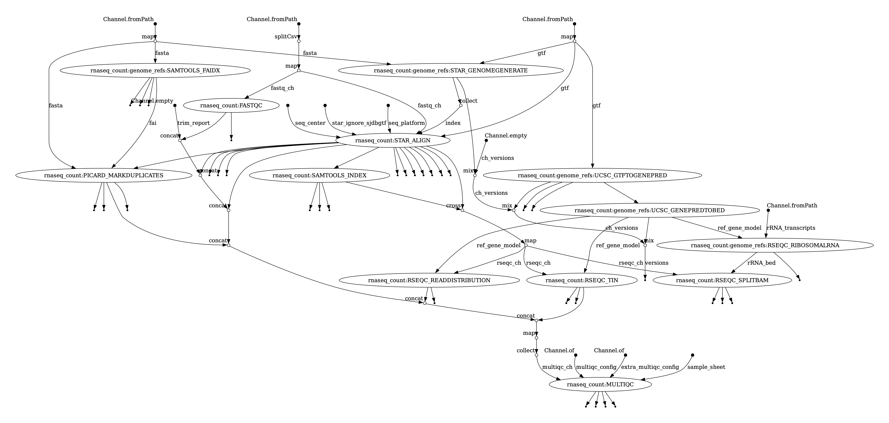
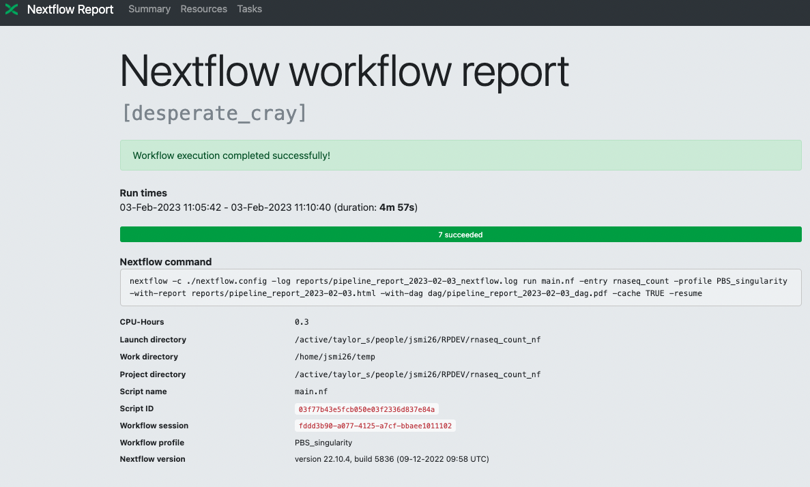

‘rnaseq_count_nf’ Nextflow Pipeline Instructions
================
Jenny L Smith
2024-02-23

-   <a href="#about-the-workflow" id="toc-about-the-workflow">About the
    Workflow</a>
-   <a href="#activate-the-environment-on-hpc"
    id="toc-activate-the-environment-on-hpc">Activate the Environment on
    HPC</a>
    -   <a href="#1-interactive-session" id="toc-1-interactive-session">1)
        Interactive Session</a>
    -   <a href="#2-open-rnaseq_count_nf-workflow-folder"
        id="toc-2-open-rnaseq_count_nf-workflow-folder">2) Open
        <code>rnaseq_count_nf</code> workflow folder</a>
    -   <a href="#3-activate-conda-environement"
        id="toc-3-activate-conda-environement">3) Activate conda
        environement</a>
-   <a href="#test-the-workflow" id="toc-test-the-workflow">Test the
    Workflow</a>
    -   <a href="#edit-the-config-file" id="toc-edit-the-config-file">Edit the
        Config File</a>
    -   <a href="#paired-end-example" id="toc-paired-end-example">Paired-end
        example</a>
    -   <a href="#single-end-example" id="toc-single-end-example">Single-end
        example</a>
    -   <a href="#sra-download-example" id="toc-sra-download-example">sra
        download example</a>
-   <a href="#modify-the-pipeline-for-your-data"
    id="toc-modify-the-pipeline-for-your-data">Modify the Pipeline for Your
    Data</a>
    -   <a href="#define-input-files" id="toc-define-input-files">Define Input
        Files</a>
    -   <a href="#nextflow-config" id="toc-nextflow-config">Nextflow Config</a>
    -   <a href="#genome-references" id="toc-genome-references">Genome
        References</a>
    -   <a href="#advanced-options" id="toc-advanced-options">Advanced
        Options</a>
-   <a href="#run-the-workflow" id="toc-run-the-workflow">Run the
    workflow</a>
-   <a href="#expected-outputs" id="toc-expected-outputs">Expected
    Outputs</a>
    -   <a href="#complete-file-structure"
        id="toc-complete-file-structure">Complete File Structure</a>
    -   <a href="#detailed-file-structure"
        id="toc-detailed-file-structure">Detailed File Structure</a>
-   <a href="#share-the-data" id="toc-share-the-data">Share the Data</a>
-   <a href="#cleaning-up-cached-data"
    id="toc-cleaning-up-cached-data">Cleaning up Cached Data</a>
-   <a href="#session-information" id="toc-session-information">Session
    Information</a>

# About the Workflow

This workflow is designed to output gene expression counts from STAR
aligner using
[`--quantmode`](https://physiology.med.cornell.edu/faculty/skrabanek/lab/angsd/lecture_notes/STARmanual.pdf).
It will also perform general QC statistics on the fastqs with
[fastqc](https://www.bioinformatics.babraham.ac.uk/projects/fastqc/) and
the alignment using [rseqc](https://rseqc.sourceforge.net/). Finally,
the QC reports are collected into a single file using
[multiQC](https://multiqc.info/).

A DAG (directed acyclic graph) of the workflow is show below:



# Activate the Environment on HPC

The directions to set-up the Nextflow workflow requirements are found in
the [README.md](../README.md). Ensure that you have followed the steps
to fork and clone the repository and created the conda nextflow
environment before starting with this document.

### 1) Interactive Session

Optional but recommended: use `tmux` on the cybertron login nodes. Name
the session nextflow and then request an interactive session, then
activate the nextflow conda environment. The account codes can be found
with `sshare` command. Change the `ACCOUNT` and `PARTITION` variables
in the code chunk below to be accurate for your Cybertron projects.

``` bash
tmux new-session -s nextflow

#List available accounts and partitions
sshare -o "Account%30,Partition%30"

#Identify appropriate account and partition and modify $ACCOUNT and $PARTITION variables
srun --account={ACCOUNT} --partition={PARTITION} --nodes 1 --ntasks 1 --cpus-per-task 1 --pty --mem=7500MB --time=8:00:00 /bin/bash

```

### 2) Open `rnaseq_count_nf` workflow folder

Navigate to where you place the cloned (copied) cutandrun_nf directory,
and then checkout the latest release branch.

``` bash
cd /path/to/my/rnaseq_count_nf
git fetch

# this will list all branches of the repository. Find the release branch with the latest version in red text, which means you don't yet have a local copy of that branch. 
git branch -a

# then select the latest version, for example 2.0.0. This downloads the stable version of pipeline locally. 
git checkout release/2.0.0

# Now the * indicates that you're on the release branch and its no longer red text. 
git branch
```

### 3) Activate conda environement

Activate the Nextflow conda environment.

``` bash
conda env create -f env/nextflow.yaml
conda activate nextflow
```
#### 4) Copy containers into directory 

Some of the containers in this workflow need to be pulled manually, so you 
will need to copy them to your container cache directory from the shared resources directory.

Modify the ASSOC parameter and execute the following command to copy them over:

``` bash 
cd /data/hps/assoc/private/{ASSOC}/container
cp /data/hps/assoc/public/bioinformatics/container/rnaseq/rseqc_3.0.1--py37h516909a_1.sif ./
cp /data/hps/assoc/public/bioinformatics/container/rnaseq/samtools_1.17--h00cdaf9_0.sif ./

```

# Test the Workflow

## Edit the Config File

Edit the `nextflow.config` file in any text editor; the example below is
in R.

You will need to change the:

-   assoc- this will be the name of the association you are working in


    //global parameters
    params {
        // general options
        sample_sheet                = "test_data/paired_end_sample_sheet.csv"
        download_sra_fqs            = false
        assoc                       = 'rsc'

    <...continues...>

``` r
usethis::edit_file("../nextflow.config")
```

## Paired-end example

Determine if the workflow works on your installation of the conda
environment by running the following command.

``` bash
./main_run.sh "paired_end_test"
```

## Single-end example

To test the single-end sheet, modify the sample_sheet parameter in the
`nextflow.config` and the output directory (`outdir`).

    params {
        // general options
        sample_sheet                = "test_data/single_end_sample_sheet.csv"
        [...]
        outdir                      = "./single_end_results/"
    <...continues...>
    }

then run the command

``` bash
./main_run.sh "single_end_test"
```

## sra download example

To test the sra sample sheet - modify these the sample sheet, and set
`download_sra_fastqs` to true in the `nextflow.config` and the output
directory (`outdir`).

    params {
        // general options
        sample_sheet                = "test_data/sra_sample_sheet.csv"
        download_sra_fqs            = true
        [...]
        outdir                      = "./sra_results/"
    <...continues...>
    }

then run on the command:

``` bash
./main_run.sh "sra_test"
```

# Modify the Pipeline for Your Data

## Define Input Files

A comma delimited (csv) sample sheet is required for the input samples
to be processed. Please note, ***do not remove*** the comment lines that
begin with “\#” in the example files. The same number of comment lines
*must* be included in any input sample sheet, based on the examples
provided here.

It must have the column names (in any order):

-   r1 - the filepath for the read 1 fastq in paired-end RNA-seq, or the
    single-end fastq file

-   r2 - the filepath for the read 2 fastq in paired-end RNA-seq

-   id - unique sample ID, no duplicates allowed in the sample sheet

-   single_end - boolean \[true/false\] if the data is single-end or
    paired-end

The two examples are provided here to look at:

``` r
example_sheet <- read.csv(here::here("test_data/paired_end_sample_sheet.csv"),
    header = TRUE, comment.char = "#")
example_sheet
```

    ##   single_end                                  r1
    ## 1      false test_data/Sample_ID_001_R1.fastq.gz
    ##                                    r2            id
    ## 1 test_data/Sample_ID_001_R2.fastq.gz Sample_ID_001

If downloading the fastq files directly from the SRA, the sample sheet
only requires the `id` and the `single_end` columns.

``` r
sra_example <- read.csv(here::here("test_data/sra_sample_sheet.csv"),
    header = TRUE, comment.char = "#")

sra_example
```

    ##          id single_end
    ## 1 SRR013553       true
    ## 2 SRR013564       true

## Nextflow Config

Edit the `nextflow.config` file to include the appropriate filepaths for
the samples to be included in the pipeline, and the appropriate genome
references. The required files are listed here:

    ## //working directory for temporary/intermediate files produced in the workflow processes
    ## workDir = "$HOME/temp"
    ## 
    ## //global parameters
    ## params {
    ##     // general options
    ##     sample_sheet                = "test_data/paired_end_sample_sheet.csv"
    ##     assoc                       = 'rsc'
    ## 
    ##     // Input and output options
    ##     download_sra_fqs            = false
    ##     outdir                      = "./paired_end_results/"
    ##     publish_dir_mode            = 'copy'
    ## 
    ## // STAR specific params
    ## index                       = '/data/hps/assoc/public/bioinformatics/annotations/Homo_sapiens/Ensembl/GRCh38/Sequence/STAR'
    ## build_index                 = false
    ##
    ## //This path uses a symlink, so if there are issues try a direct path 
    ## gtf                         = '/data/hps/assoc/public/bioinformatics/annotations/Homo_sapiens/Ensembl/GRCh38/Annotation/Genes.ensembl' // required
    ## fasta                       = '/data/hps/assoc/public/bioinformatics/annotations/Homo_sapiens/Ensembl/GRCh38/Sequence/WholeGenomeFasta/Homo_sapiens.GRCh38.dna.primary_assembly.fa' // required
    ## <...>

## Genome References

Rseqc reference bed files are generated using the provided GTF file in
params section of the `nextflow.config` file. The ref_gene_model is
generated in BED12 format using UCSC utilities (Kent tools). This allows
the Rseqc references to match the transcript IDs used in the GTF for
STAR aligner. The pipeline does require the user to provide a list of
rRNA transcript IDs that match the transcript ID format in the provided
GTF.

The easiest way to find the rRNA transcripts is to use [Ensembl
Biomart](http://useast.ensembl.org/biomart/martview/d3ad0d42cda078c0acc2a4b2c18a9164)
or [UCSC table browser](https://genome.ucsc.edu/cgi-bin/hgTables). For
Ensembl, use a filter based on the rRNA biotypes you would like to
quantify (eg Mt_rRNA , rRNA , rRNA_pseudogene) and then select
“Transcript stable ID” as the Attribute to save to file.

In R, this could be accomplished with:

    library(biomaRt)
    species <- "Homo_sapiens"
    mart <- useEnsembl('ensembl', dataset = 'Homo_sapiens_gene_ensembl')
    biomaRt::getBM(values=c("rRNA", "rRNA_pseudogene","Mt_rRNA"),
                   filters="biotype", 
                   attributes=c("ensembl_transcript_id"), 
                   mart = mart)

An example of the gene models and rRNA bed files can be found at the
RSEQC [documentation
page](http://rseqc.sourceforge.net/#download-gene-models-update-on-12-14-2021)
and are located at `/gpfs/shared_data/rseqc` to share with the SCRI.

## Advanced Options

In the `nextflow.config`, you can define additional command line
arguments to the scientific software under [process
scope](https://www.nextflow.io/docs/latest/process.html#).

    ## // Computational resource allocation for the processes run in the workflow
    ## process {
    ##     publishDir = [
    ##         path: { "${params.outdir}/${task.process.tokenize(':')[-1].tokenize('_')[0].toLowerCase()}" },
    ##         mode: params.publish_dir_mode,
    ##         saveAs: { filename -> filename.equals('versions.yml') ? null : filename }
    ##     ]
    ##     errorStrategy = "retry"
    ##     maxRetries = 2
    ## 
    ##     //STAR-aligner process specific parameters
    ##     //https://www.nextflow.io/docs/latest/process.html#dynamic-computing-resources
    ##     withName: STAR_ALIGN {
    ##         cpus = { 4 * task.attempt }
    ##         memory = { 32.GB * task.attempt }
    ## <...>

You may use the advanced options to change computational resources
requested for different processes. The CPUs and memory parameters can
updated to request a larger amount of resources like CPUs or memory if
files are large. You may also edit the commandline parameters for
processes in the workflow using the `ext.args`
[directive](https://www.nextflow.io/docs/latest/process.html#directives).

The current TRIMGALORE paramters look like this:

    ##     //Trimgalore process specific parameters
    ##     withName: TRIMGALORE {
    ##         cpus = { 2 * task.attempt }
    ##         memory = { 8.GB * task.attempt }
    ##         ext.args = ''
    ##     }
    ## 
    ## <...>

But you’d like to request 16Gb of memory for and gzip the output.

    ##     //Trimgalore process specific parameters
    ##     withName: TRIMGALORE {
    ##         cpus = { 2 * task.attempt }
    ##         memory = { 16.GB * task.attempt }
    ##         ext.args = '--gzip'
    ##     }
    ## 
    ## <...>

# Run the workflow

Then execute a wrapper around the `nextflow run main.nf` command which
is in the `main_run.sh` shell script. Provide a descriptive name
(string) for your workflow run, in this example we will use
“my_analysis”.

Typically, you will not need to change the `main_run.sh` often.

The `main_run.sh` script defines the profiles for different executors in
the variable `NFX_PROFILE`. The choices for profiles are:

-   sasquatch_apptainer \[default\]

This profile executes the jobs on the HPC using the SLURM scheduler and then will 
run the job inside singularityncontainers with the appropriate scientific 
software versions.

You can also change the
[`entry_point`](https://www.nextflow.io/docs/latest/dsl2.html#workflow-entrypoint)
for the workflow.

-   Run only the index building step using `NFX_ENTRY='star_index'`.
-   Run only the download step for SRA files by setting
    `NFX_ENTRY='sra_fastqs'`.
-   Keep the default `NFX_ENTRY='rnaseq_count'` to run the complete
    pipeline.

``` bash
./main_run.sh "my_analysis"
```

# Expected Outputs

Under the path provided in the nextflow config for params “outdir”, lets
say `paired_end_results/`, you will find directories named for each of
the modules.

In addition, there will be an HTML report with information on where the
temp data is stored in the `workDir` path, and general run statistics
such as resource utilized versus requested, which helps with
optimization. It will also provide information on how much walltime was
used per sample, total CPU hours, etc.

The HTML file is found in `reports` directory and will have the prefix
defined on the command line when the `./main_run.sh "my_analysis"` was
invoked, so in this example it would be named
“my_analysis\_{DATE}.html”.



There will also be a detailed nextflow log file that is useful for
de-bugging which will also be named in this example,
“my_analysis\_{DATE}\_nextflow.log”.

Finally, the pipeline will produce a DAG - Directed acyclic graph which
describes the workflow channels (inputs) and the modules. The DAG image
will be saved under `dag/` directory with the name
“my_analysis\_{DATE}\_dag.pdf”.


### Complete File Structure

There will be the following file structure:

    ## ../paired_end_results/
    ## ├── fastqc
    ## │   └── fastqc_Sample_ID_001
    ## ├── multiqc
    ## │   ├── paired_end_sample_sheet_multiqc_report.html
    ## │   ├── paired_end_sample_sheet_multiqc_report_data
    ## │   └── paired_end_sample_sheet_multiqc_report_plots
    ## ├── picard
    ## │   ├── Sample_ID_001.MarkDuplicates.metrics.txt
    ## │   └── Sample_ID_001.bam
    ## ├── rseqc
    ## │   ├── Homo_sapiens.GRCh38.106.sort.rRNA.bed
    ## │   ├── Sample_ID_001.Aligned.sortedByCoord.out.summary.txt
    ## │   ├── Sample_ID_001.Aligned.sortedByCoord.out.tin.xls
    ## │   ├── Sample_ID_001.in.bam
    ## │   ├── Sample_ID_001.read_distribution.txt
    ## │   └── Sample_ID_001_rRNA_stats.out
    ## ├── samtools
    ## │   ├── Homo_sapiens.GRCh38.dna.primary_assembly.fa.fai
    ## │   └── Sample_ID_001.Aligned.sortedByCoord.out.bam.bai
    ## ├── star
    ## │   ├── Sample_ID_001.Aligned.sortedByCoord.out.bam
    ## │   ├── Sample_ID_001.Log.final.out
    ## │   ├── Sample_ID_001.Log.out
    ## │   ├── Sample_ID_001.Log.progress.out
    ## │   ├── Sample_ID_001.ReadsPerGene.out.tab
    ## │   └── Sample_ID_001.SJ.out.tab
    ## └── ucsc
    ##     ├── Homo_sapiens.GRCh38.106.genepred
    ##     ├── Homo_sapiens.GRCh38.106.refflat
    ##     ├── Homo_sapiens.GRCh38.106.sort.bed
    ##     └── Homo_sapiens.GRCh38.106_transcript.infoOut.txt

### Detailed File Structure

Within each directory you will find the following files (top 5 files per
directory are shown):

| path                                                                            | type      | process                     | filename                                            |
|:--------------------------------------------------------------------------------|:----------|:----------------------------|:----------------------------------------------------|
| ../paired_end_results/fastqc                                                    | directory | fastqc                      |                                                     |
| ../paired_end_results/fastqc/fastqc_Sample_ID_001/Sample_ID_001_1\_fastqc.html  | file      | fastqc                      | Sample_ID_001_1\_fastqc.html                        |
| ../paired_end_results/fastqc/fastqc_Sample_ID_001/Sample_ID_001_1\_fastqc.zip   | file      | fastqc                      | Sample_ID_001_1\_fastqc.zip                         |
| ../paired_end_results/fastqc/fastqc_Sample_ID_001/Sample_ID_001_2\_fastqc.html  | file      | fastqc                      | Sample_ID_001_2\_fastqc.html                        |
| ../paired_end_results/fastqc/fastqc_Sample_ID_001/Sample_ID_001_2\_fastqc.zip   | file      | fastqc                      | Sample_ID_001_2\_fastqc.zip                         |
| ../paired_end_results/fastqc/fastqc_Sample_ID_001                               | directory | fastqc/fastqc_Sample_ID_001 |                                                     |
| ../paired_end_results/multiqc                                                   | directory | multiqc                     |                                                     |
| ../paired_end_results/picard                                                    | directory | picard                      |                                                     |
| ../paired_end_results/picard/Sample_ID_001.MarkDuplicates.metrics.txt           | file      | picard                      | Sample_ID_001.MarkDuplicates.metrics.txt            |
| ../paired_end_results/picard/Sample_ID_001.bam                                  | file      | picard                      | Sample_ID_001.bam                                   |
| ../paired_end_results/rseqc                                                     | directory | rseqc                       |                                                     |
| ../paired_end_results/rseqc/Homo_sapiens.GRCh38.106.sort.rRNA.bed               | file      | rseqc                       | Homo_sapiens.GRCh38.106.sort.rRNA.bed               |
| ../paired_end_results/rseqc/Sample_ID_001.Aligned.sortedByCoord.out.summary.txt | file      | rseqc                       | Sample_ID_001.Aligned.sortedByCoord.out.summary.txt |
| ../paired_end_results/rseqc/Sample_ID_001.Aligned.sortedByCoord.out.tin.xls     | file      | rseqc                       | Sample_ID_001.Aligned.sortedByCoord.out.tin.xls     |
| ../paired_end_results/rseqc/Sample_ID_001.in.bam                                | file      | rseqc                       | Sample_ID_001.in.bam                                |
| ../paired_end_results/samtools                                                  | directory | samtools                    |                                                     |
| ../paired_end_results/samtools/Homo_sapiens.GRCh38.dna.primary_assembly.fa.fai  | file      | samtools                    | Homo_sapiens.GRCh38.dna.primary_assembly.fa.fai     |
| ../paired_end_results/samtools/Sample_ID_001.Aligned.sortedByCoord.out.bam.bai  | file      | samtools                    | Sample_ID_001.Aligned.sortedByCoord.out.bam.bai     |
| ../paired_end_results/star                                                      | directory | star                        |                                                     |
| ../paired_end_results/star/Sample_ID_001.Aligned.sortedByCoord.out.bam          | file      | star                        | Sample_ID_001.Aligned.sortedByCoord.out.bam         |
| ../paired_end_results/star/Sample_ID_001.Log.final.out                          | file      | star                        | Sample_ID_001.Log.final.out                         |
| ../paired_end_results/star/Sample_ID_001.Log.out                                | file      | star                        | Sample_ID_001.Log.out                               |
| ../paired_end_results/star/Sample_ID_001.Log.progress.out                       | file      | star                        | Sample_ID_001.Log.progress.out                      |
| ../paired_end_results/ucsc                                                      | directory | ucsc                        |                                                     |
| ../paired_end_results/ucsc/Homo_sapiens.GRCh38.106.genepred                     | file      | ucsc                        | Homo_sapiens.GRCh38.106.genepred                    |
| ../paired_end_results/ucsc/Homo_sapiens.GRCh38.106.refflat                      | file      | ucsc                        | Homo_sapiens.GRCh38.106.refflat                     |
| ../paired_end_results/ucsc/Homo_sapiens.GRCh38.106.sort.bed                     | file      | ucsc                        | Homo_sapiens.GRCh38.106.sort.bed                    |
| ../paired_end_results/ucsc/Homo_sapiens.GRCh38.106_transcript.infoOut.txt       | file      | ucsc                        | Homo_sapiens.GRCh38.106_transcript.infoOut.txt      |

# Share the Data

``` bash
RESULTS="PATH/TO/PIPELINE/RESULTS/"
OUTDIR="path/to/collabs/RSS"
rsync -av $RESULTS $OUTDIR 
```

# Cleaning up Cached Data

Nextflow has an utility to
[clean](https://www.nextflow.io/docs/latest/cli.html#clean) up old work
directories and logs that are no longer needed. This can be run after
any amount of time to keep your workdir from getting too large or if
you’re running out of disk space.

This requires the session ID or session name, which can found in the
`.nextflow/history` file.

``` bash
nextflow log
nextflow clean -f [RUN NAME]
```

# Session Information

``` r
sessionInfo()
```
